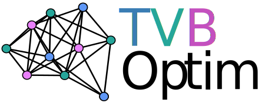

> [!IMPORTANT]
> **Repository Status:** This repository serves as a placeholder. The complete source code, documentation, and examples will be published here once our associated paper has been accepted and published. Please check back or watch this repository for updates.

# TVBOptim

[JAX](https://jax.readthedocs.io/en/latest/)-based Optimization tools for [The Virtual Brain Ontology (TVBO)](https://github.com/virtual-twin/tvbo).

## Features

✅ Fast Simulations on CPU and GPU

✅ Fully Differentiable via JAXs automatic differentiation capabilities 

✅ Easy to use: Tested workflows for common problems

✅ Easy to extend: Access to the generated code allows easy customizations for novel applications 

## Contact

If you have any questions or want to try the code, please reach out to us!

* *marius.pille[at]bih-charite.de*